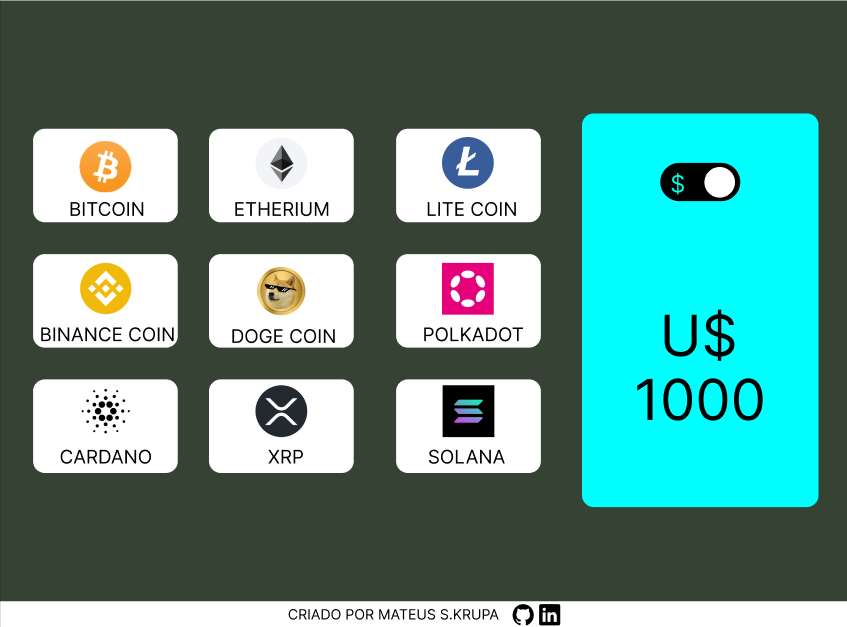
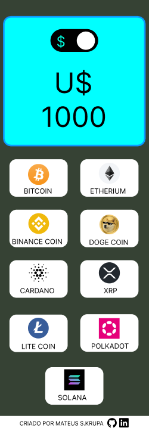

Projeto Cripto Convert

Esse projeto foi criado com a finalidade de, qualquer pessoa saber os preços das principais criptomoedas que podem ser compradas com BRL(real), na plataforma Binance, de uma forma prática e interativa.

MODO DE USO
É muito simples, à esquerda da tela, o usuário seleciona por meio de um click, a criptomoeda que deseja saber o valor, e o valor é mostrado do display a direita da tela.
O display possui uma chave (estilo liga e desliga), que seleciona a moeda que o usuário deseja saber o preço, podendo ser dolar ou real.
Todos os preços das criptomoedas são calculados instantaneamente após o usuário clicar nos botões ou mudar a chave dólar/real, por meio de uma requisição na API da Binance.

DESENVOLVIMENTO DO PROJETO

No total, foram utilizadas 9 horas, dividido em 3 dias, para o desenvolvimento do projeto.
Escolhi fazer um conversor de criptomoedas, pois a API da Binance é bem fácil de se utilizar.
Meu maior desafio nesse projeto foi fazer a chave de conversão dólar/real funcionar corretamente.

DESIGN ANTES DA IMPLEMENTAÇÃO

Desenvolvido por Mateus S.Krupa